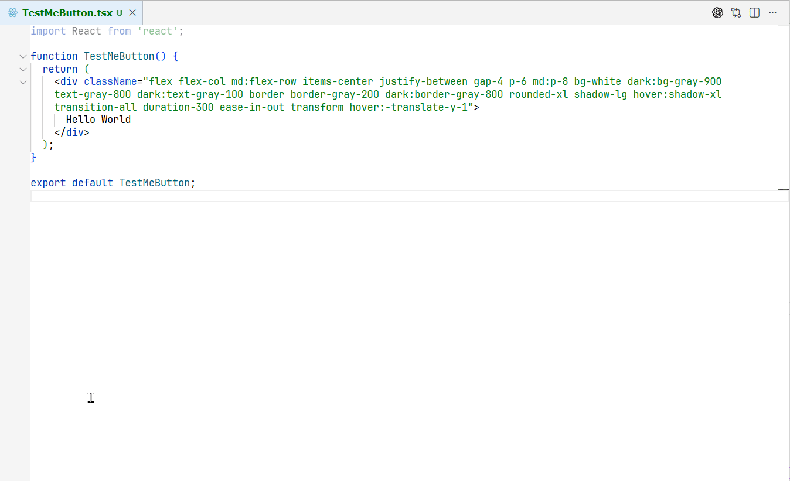

# Split Spaced Strings

Toggle between single-line and multi-line string formats with a simple keyboard shortcut. Perfect for working with CSS classes, particularly Tailwind CSS, and improving code readability.



## Features

- **Smart String Detection**: Automatically detects if your cursor is inside a string literal (single quotes, double quotes, or template literals)
- **One-Key Toggle**: Seamlessly switch between single-line and multi-line formats
- **Word-Per-Line Splitting**: Each word in the string gets its own line for better readability
- **Preserves Indentation**: Maintains proper code indentation when splitting strings
- **Reversible**: Toggle back and forth as many times as needed
- **Auto-Collapse on Save**: Optional feature to automatically collapse split strings back to single line when saving (disabled by default)
- **Visual Tracking**: Split strings are highlighted with a subtle background color to indicate they will be auto-collapsed on save

## Use Cases

Perfect for:
- **Tailwind CSS Classes**: Manage long className strings in React/JSX
- **CSS Classes**: Organize multiple class names
- **String Lists**: Any space-separated string that becomes hard to read when long
- **Code Review**: Make strings more readable before committing

## Usage

### Keyboard Shortcut

Press `Alt+Shift+S` with your cursor inside any string literal.

### Command Palette

1. Open Command Palette (`Ctrl+Shift+P` or `Cmd+Shift+P`)
2. Type "Toggle Split/Merge String"
3. Press Enter

### Customizing the Keyboard Shortcut

1. Go to `File` → `Preferences` → `Keyboard Shortcuts` (or press `Ctrl+K Ctrl+S`)
2. Search for "Toggle Split/Merge String"
3. Click on the current keybinding and assign your preferred shortcut

## Settings

### Auto-Collapse on Save

By default, split strings remain in their multi-line format. However, you can enable automatic collapsing back to single line when saving the file:

1. Open Settings (`Ctrl+,` or `Cmd+,`)
2. Search for "Split Spaced Strings"
3. Enable "Auto Collapse On Save"

Or add to your `settings.json`:
```json
{
  "splitSpacedStrings.autoCollapseOnSave": true
}
```

When enabled:
- Any string you split using `Alt+Shift+S` will be highlighted with a subtle yellow background
- When you save the file (`Ctrl+S`), all highlighted strings will automatically collapse back to single line
- This is useful for temporary formatting while editing, ensuring committed code stays compact

## Example
```tsx
// Before
<div className="flex items-center justify-between p-4 bg-white rounded-lg shadow-md hover:shadow-lg transition-shadow duration-200">

// After splitting (Alt+Shift+S)
<div className="
  flex
  items-center
  justify-between
  p-4
  bg-white
  rounded-lg
  shadow-md
  hover:shadow-lg
  transition-shadow
  duration-200
">
```

## Supported String Types

- Single quotes: `'string'`
- Double quotes: `"string"`
- Template literals: `` `string` ``

All string types work with both single-line and multi-line formats.

